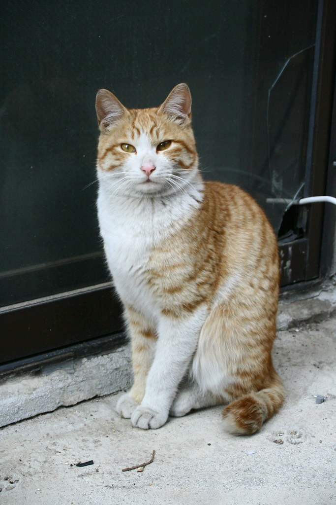
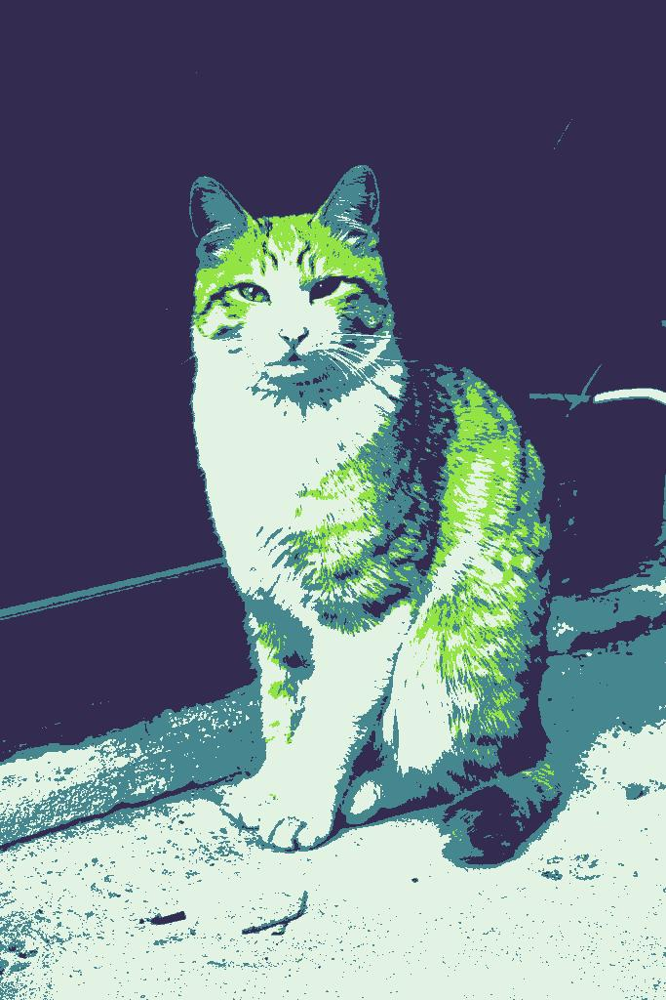

# GameBoy image converter

Convert an image to a palette restricted one such as the glorious gameboy's 4 colors palette.

Usage : 
```
./gbconv.py (inputimage) (outputimage)
```

This script require Pillow library, run `requirement.txt` in pip to install.

# Demo

 Input | Output
--------|--------
 |

# License
The cat image ([cat_cc.jpg](https://ccsearch.creativecommons.org/photos/fc88617d-94ed-4221-8b67-aa558beeb4fc)) is licensed under public domain / CC0 1.0

The script is under GNU - GPL 3.0 license, see `LICENSE` for more details.
